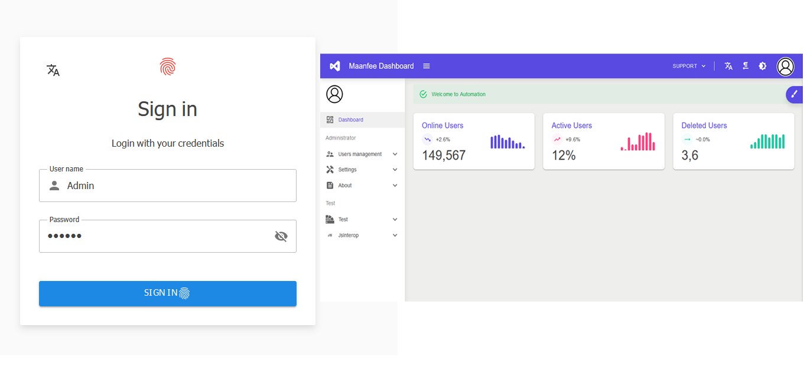
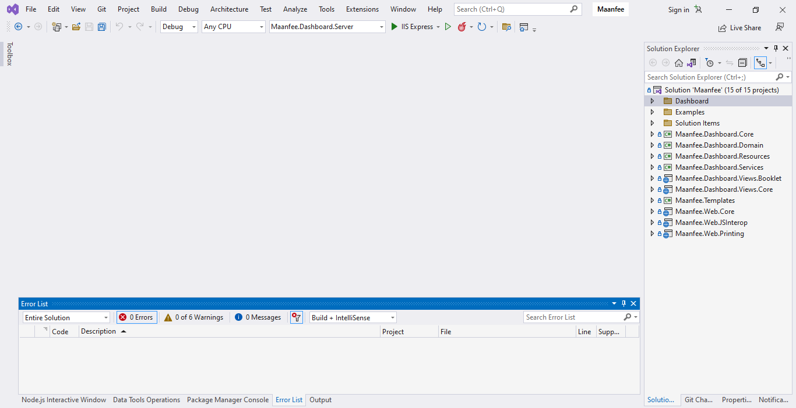


<div align="center">
  <picture>
    
  </picture>
  <h2 align="center">
    Maanfee Dashboard - MudBlazor Template
  </h2>
  <p align="center">
    Open source solution template for Blazor WebAssembly built with MudBlazor components.
  </p>
  <div>
      <a href="https://github.com/Maanfee/Maanfee-Dashboard/blob/main/LICENSE" target="_blank">
        
      </a>
      <a href="https://www.linkedin.com/in/mansour-farshidi-091a41185/" target="_blank">
        
      </a>    
 </div>
</div>

## 📸 Screenshots


## 📋 Prerequisites
- **Supported .NET version:**  
  - [.NET 10.0](https://dotnet.microsoft.com/en-us/download/dotnet/10.0) 

## 🛠 Development Environment
- [Microsoft Visual Studio 2026](https://visualstudio.microsoft.com/downloads/) 
- [.NET 10.0](https://dotnet.microsoft.com/en-us/download/dotnet/10.0) 

## 🗃 Supported Databases
- [Microsoft SQL Server](https://www.microsoft.com/en-us/sql-server/sql-server-downloads) 
- [SQLite](https://www.sqlite.org/index.html) 

## 🚀 How to Build the Solution
### SQL Server Connection String Configuration

In the `appsettings.json` file of the `Maanfee.Dashboard.Server` and `Maanfee.Logging.Server` projects, set the `SQLServerConnection_DebugMode` connection string as follows:

```json
{
  "ConnectionStrings": {
    "SQLServerConnection_DebugMode": "Your_Connection_String_Here"
  }
}
```

### Configuration Details

#### Local SQL Server (Windows Authentication)
```text
Server=.;Database=YourDB;Trusted_Connection=True;
```

#### Remote SQL Server (SQL Authentication)
```text
Server=your_server_ip;Database=YourDB;User Id=username;Password=password;
```

#### Common Parameters
- `Server`: Server name/IP (`.` for local)
- `Database`: Database name
- `Trusted_Connection`: Windows authentication
- `User Id/Password`: SQL authentication
- `MultipleActiveResultSets`: Enable MARS feature

#### 🔐 Security Note:
> Always keep connection strings secure and never commit sensitive credentials to version control.

### Configure Startup Projects
Right click on the solution name and then select 
"properties->multiple startup projects" then set followings project 
as startup.

-`Maanfee.Dashboard.Server` 

-`Gateway.Api`

-`Maanfee.Logging.Server`

### Run solution

- Default login credentials
    - Username : `Admin`
    - Password : `123456`

> ⚠️ **Important Notice:**
Maanfee Dashboard is under active development. Before running a new version, please delete any existing database (SQL Server or SQLite) to avoid migration conflicts.

📦 Release History
- [01-10-08 : Init]()


 