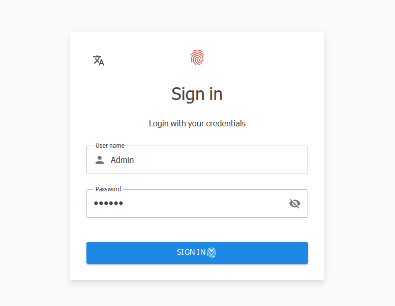

  <picture>
    
  </picture>
  <h2 align="center">
    Maanfee Dashboard MudBlazor Template
  </h2>
  

    Open source solution template for Blazor Web-Assembly  built with MudBlazor
  

  

      
        
 

## Screenshots 

## Prerequisites
- Supported .NET versions
  - [.NET 7.0](https://dotnet.microsoft.com/en-us/download/dotnet/7.0) 

## Development Enviroment
- [Microsoft Visual Studio 2022 (64-bit)](https://visualstudio.microsoft.com/downloads/) 
- [.NET 7.0](https://dotnet.microsoft.com/en-us/download/dotnet/7.0) 

## Supported databases
- [Microsoft SQL Server](https://www.microsoft.com/en-us/sql-server/sql-server-downloads) 
- [SQLite](https://www.sqlite.org/index.html) 

## How to build solution 
- Open 'Mcafee.Dashboard.Server' project and then
configure 'connection string' in appsettings.json. 
- Run solution

- Default login credentials
    - Username : Admin
    - Password : 123456
    
    > **Important**
As the Maanfee dashboard is under development, please make sure you delete your existing database (SQL Server, SQLite). Also install the latest version of Maanfee dashboard.

**Project History Releases**

- [01-10-08 : Init]()
 